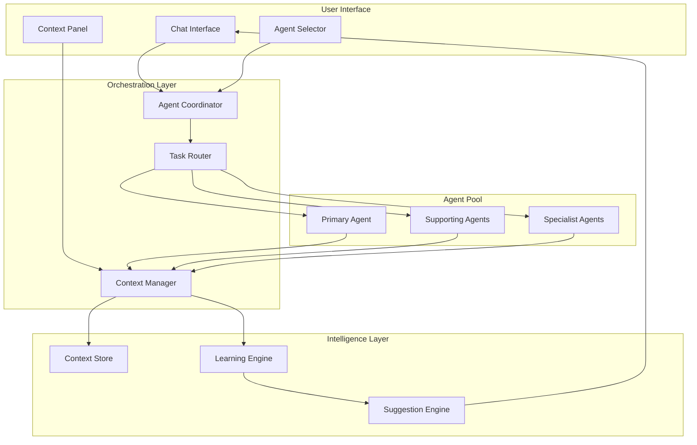
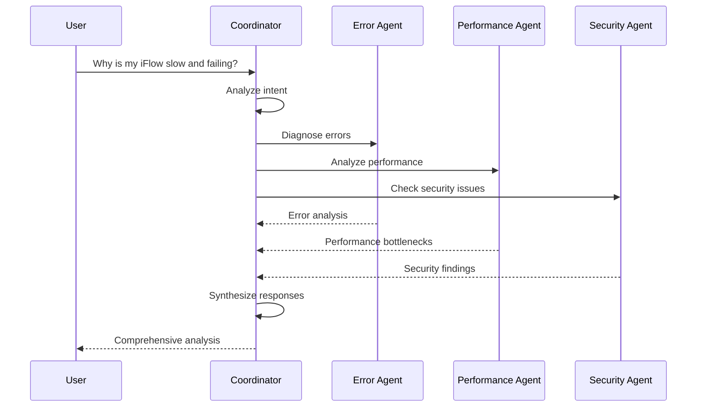

# AI Agent Complete Redesign Plan
## Modern AI-Powered Integration Assistant

**Project**: SAP CPI Connect - AI Agent Modernization  
**Version**: 2.0  
**Date**: December 5, 2024  
**Scope**: Complete overhaul with advanced AI features

---

## Executive Summary

This plan outlines a comprehensive redesign of the AI Agent system in SAP CPI Connect, transforming it from a basic chat interface into a sophisticated, multi-agent orchestration platform with context-aware responses, smart suggestions, and advanced analytics.

### Current State Analysis

**Strengths:**
- ✅ 9 specialized AI agents with clear purposes
- ✅ Clean, functional chat interface with markdown support
- ✅ Conversation history tracking
- ✅ Integration with Convex for data persistence
- ✅ Streaming responses for better UX
- ✅ Mermaid diagram rendering
- ✅ Multi-tenant support with proper security

**Limitations:**
- ❌ Single-agent conversations (no multi-agent collaboration)
- ❌ No context persistence across conversations
- ❌ Limited conversation management (no branching, forking, or merging)
- ❌ Basic analytics (only execution counts and tokens)
- ❌ No smart suggestions or auto-completion
- ❌ No voice input or accessibility features
- ❌ Limited mobile optimization
- ❌ No collaborative features (sharing, commenting)
- ❌ No agent-to-agent communication
- ❌ Static prompts without learning capabilities

---

## Design Philosophy

### Core Principles

1. **Intelligence First**: AI should anticipate needs, not just respond to requests
2. **Contextual Awareness**: Every interaction builds on previous knowledge
3. **Collaborative Intelligence**: Multiple agents work together seamlessly
4. **Progressive Disclosure**: Show complexity only when needed
5. **Accessibility**: Voice, keyboard, and screen reader support
6. **Performance**: Sub-second response times, optimistic UI updates
7. **Consistency**: Align with app's existing design system

### Visual Design Language

**Modern Aesthetic:**
- Glassmorphism effects for depth and hierarchy
- Smooth micro-animations for state transitions
- Gradient accents for AI-powered features
- Neumorphic elements for interactive components
- Dark mode optimized with proper contrast ratios

**Color System:**
```css
/* AI Agent Color Palette */
--ai-primary: hsl(239, 84%, 67%);        /* Indigo for AI */
--ai-secondary: hsl(271, 91%, 65%);      /* Purple for insights */
--ai-success: hsl(142, 71%, 45%);        /* Green for completion */
--ai-warning: hsl(38, 92%, 50%);         /* Amber for suggestions */
--ai-error: hsl(0, 84%, 60%);            /* Red for errors */
--ai-gradient: linear-gradient(135deg, var(--ai-primary), var(--ai-secondary));
--glass-bg: rgba(255, 255, 255, 0.05);
--glass-border: rgba(255, 255, 255, 0.1);
```

---

## Architecture Redesign

### 1. Multi-Agent Orchestration System



**Key Components:**

#### Agent Coordinator
- Manages multi-agent conversations
- Routes tasks to appropriate agents
- Handles agent-to-agent handoffs
- Coordinates parallel agent execution
- Merges responses from multiple agents

#### Context Manager
- Maintains conversation context across sessions
- Tracks user preferences and patterns
- Builds knowledge graph of integrations
- Provides relevant context to agents
- Manages context window optimization

#### Task Router
- Analyzes user intent
- Determines optimal agent(s) for task
- Splits complex tasks into subtasks
- Assigns subtasks to specialist agents
- Aggregates results

---

### 2. Enhanced Component Architecture

```typescript
// New component structure
components/ai/
├── v2/
│   ├── agent-workspace.tsx          // Main container
│   ├── multi-agent-chat.tsx         // Enhanced chat with multi-agent support
│   ├── context-panel.tsx            // Context visualization
│   ├── agent-orchestrator.tsx       // Agent coordination UI
│   ├── smart-input.tsx              // Input with suggestions
│   ├── conversation-tree.tsx        // Branching conversations
│   ├── agent-collaboration.tsx      // Multi-agent view
│   ├── voice-input.tsx              // Voice interaction
│   ├── analytics-dashboard.tsx      // Advanced analytics
│   └── shared/
│       ├── message-bubble.tsx       // Enhanced message display
│       ├── agent-avatar.tsx         // Animated agent avatars
│       ├── typing-indicator.tsx     // Advanced loading states
│       ├── suggestion-chip.tsx      // Smart suggestions
│       └── context-badge.tsx        // Context indicators
```

---

## Feature Specifications

### 1. Multi-Agent Orchestration

**Capability**: Multiple agents collaborate on complex tasks

**User Flow:**


**UI Design:**
- **Agent Pills**: Show active agents with animated indicators
- **Response Sections**: Clearly labeled by contributing agent
- **Collaboration Timeline**: Visual representation of agent handoffs
- **Confidence Scores**: Each agent shows confidence in their analysis

**Implementation:**
```typescript
interface MultiAgentExecution {
  coordinatorId: string;
  primaryAgent: AIAgentType;
  supportingAgents: AIAgentType[];
  taskDecomposition: SubTask[];
  responses: AgentResponse[];
  synthesizedResponse: string;
  collaborationMetrics: {
    agentsInvolved: number;
    handoffs: number;
    parallelExecutions: number;
  };
}
```

---

### 2. Context-Aware Response System

**Capability**: Agents remember and learn from previous interactions

**Context Types:**
1. **Session Context**: Current conversation thread
2. **User Context**: Preferences, expertise level, common tasks
3. **Integration Context**: iFlow history, error patterns, configurations
4. **Temporal Context**: Time-based patterns, recent changes
5. **Organizational Context**: Team patterns, shared knowledge

**Context Panel Design:**
```
┌─────────────────────────────────────┐
│ 🧠 Active Context                   │
├─────────────────────────────────────┤
│ 📊 Current iFlow: Payment-API-v2    │
│ ⏱️  Recent: 3 failures in 2 hours   │
│ 👤 Your Pattern: Usually checks logs│
│ 🔗 Related: Similar error in Auth   │
│ 💡 Suggestion: Check certificate    │
└─────────────────────────────────────┘
```

**Implementation:**
```typescript
interface ConversationContext {
  sessionId: string;
  userId: string;
  tenantId?: string;
  iflowId?: string;
  
  // Historical context
  previousConversations: ConversationSummary[];
  userPreferences: UserPreferences;
  commonPatterns: Pattern[];
  
  // Current context
  activeEntities: Entity[];
  recentActions: Action[];
  environmentState: EnvironmentSnapshot;
  
  // Predictive context
  likelyNextSteps: Prediction[];
  relevantKnowledge: KnowledgeItem[];
  suggestedAgents: AIAgentType[];
}
```

---

### 3. Smart Suggestions & Auto-Completion

**Capability**: Proactive assistance before user asks

**Suggestion Types:**

1. **Intent Suggestions**
   - "Based on recent errors, would you like me to analyze performance?"
   - "I notice you're checking logs. Should I diagnose the root cause?"

2. **Action Suggestions**
   - Quick actions: "Restart iFlow", "View logs", "Check credentials"
   - Common queries: "Show error trends", "Compare with yesterday"

3. **Context Suggestions**
   - "This iFlow has similar issues to Payment-API-v1"
   - "3 other team members asked about this today"

4. **Input Auto-Completion**
   - Agent-specific command completion
   - iFlow name completion
   - Error code completion
   - Natural language templates

**UI Design:**
```
┌─────────────────────────────────────────────┐
│ 💬 Ask Error Diagnostician...              │
│                                             │
│ 💡 Suggested:                               │
│ ┌─────────────────────────────────────────┐│
│ │ 🔍 Analyze recent spike in failures    ││
│ │ 📊 Compare error patterns this week     ││
│ │ 🔧 Diagnose Payment-API-v2 timeout      ││
│ └─────────────────────────────────────────┘│
│                                             │
│ ⌨️  Or type your question...                │
└─────────────────────────────────────────────┘
```

**Implementation:**
```typescript
interface SmartSuggestion {
  id: string;
  type: 'intent' | 'action' | 'context' | 'completion';
  priority: number;
  confidence: number;
  
  // Suggestion content
  title: string;
  description?: string;
  icon?: string;
  
  // Action
  action: {
    type: 'execute_agent' | 'navigate' | 'insert_text';
    payload: any;
  };
  
  // Context
  reasoning: string;
  basedOn: string[];
}
```

---

### 4. Conversation Management

**Capability**: Advanced conversation organization and navigation

**Features:**

1. **Conversation Branching**
   - Fork conversations at any point
   - Explore alternative solutions
   - Compare different agent approaches
   - Merge insights from branches

2. **Conversation Templates**
   - Pre-built conversation flows
   - Common troubleshooting paths
   - Best practice workflows
   - Custom templates

3. **Conversation Search**
   - Full-text search across all conversations
   - Filter by agent, date, topic, outcome
   - Semantic search (find similar issues)
   - Tag-based organization

4. **Conversation Sharing**
   - Share with team members
   - Export as markdown/PDF
   - Create knowledge base articles
   - Collaborative annotations

**UI Design:**
```
┌─────────────────────────────────────────────┐
│ 📚 Conversations                            │
├─────────────────────────────────────────────┤
│ 🔍 Search conversations...                  │
├─────────────────────────────────────────────┤
│ 📌 Pinned                                   │
│ ├─ 🔴 Production Error Investigation        │
│ └─ 📊 Monthly Performance Review            │
│                                             │
│ 📅 Today                                    │
│ ├─ 🔧 Payment API Timeout (3 branches)     │
│ │   ├─ Branch A: Performance focus         │
│ │   ├─ Branch B: Security audit            │
│ │   └─ Branch C: Code review               │
│ └─ 📝 Documentation for Auth Flow           │
│                                             │
│ 📅 Yesterday                                │
│ └─ 🔍 Error Pattern Analysis                │
└─────────────────────────────────────────────┘
```

---

### 5. Voice Interaction

**Capability**: Hands-free interaction with AI agents

**Features:**
- Voice-to-text input
- Text-to-speech responses
- Voice commands for navigation
- Multi-language support
- Noise cancellation
- Wake word detection ("Hey Agent")

**UI Design:**
```
┌─────────────────────────────────────┐
│ 🎤 Voice Input                      │
├─────────────────────────────────────┤
│                                     │
│        ⚫ ⚫ ⚫ ⚫ ⚫                  │
│       ⚫ ⚫ ⚫ ⚫ ⚫ ⚫                 │
│      ⚫ ⚫ ⚫ ⚫ ⚫ ⚫ ⚫                │
│       ⚫ ⚫ ⚫ ⚫ ⚫ ⚫                 │
│        ⚫ ⚫ ⚫ ⚫ ⚫                  │
│                                     │
│   Listening... Speak now            │
│                                     │
│   [Stop] [Cancel]                   │
└─────────────────────────────────────┘
```

---

### 6. Advanced Analytics Dashboard

**Capability**: Deep insights into AI agent usage and effectiveness

**Metrics:**

1. **Usage Analytics**
   - Executions by agent, time, user
   - Token consumption trends
   - Response time distribution
   - Success/failure rates

2. **Effectiveness Metrics**
   - User satisfaction scores
   - Task completion rates
   - Follow-up question frequency
   - Agent accuracy ratings

3. **Cost Analytics**
   - Token costs by agent
   - Cost per conversation
   - ROI calculations
   - Budget forecasting

4. **Pattern Analysis**
   - Common question patterns
   - Peak usage times
   - Agent collaboration patterns
   - Error resolution paths

**Dashboard Design:**
```
┌─────────────────────────────────────────────────────────┐
│ 📊 AI Agent Analytics                                   │
├─────────────────────────────────────────────────────────┤
│                                                         │
│ ┌─────────────┐ ┌─────────────┐ ┌─────────────┐       │
│ │ 1,247       │ │ 89.3%       │ │ $127.50     │       │
│ │ Executions  │ │ Success     │ │ This Month  │       │
│ └─────────────┘ └─────────────┘ └─────────────┘       │
│                                                         │
│ 📈 Usage Trends (Last 30 Days)                         │
│ ┌─────────────────────────────────────────────────┐   │
│ │     ╭─╮                                         │   │
│ │   ╭─╯ ╰─╮     ╭─╮                              │   │
│ │ ╭─╯     ╰─╮ ╭─╯ ╰─╮                            │   │
│ │─╯         ╰─╯     ╰─────────────────────────   │   │
│ └─────────────────────────────────────────────────┘   │
│                                                         │
│ 🤖 Agent Performance                                   │
│ ┌─────────────────────────────────────────────────┐   │
│ │ Error Diagnostician    ████████░░ 87% (234)    │   │
│ │ iFlow Creator          ███████░░░ 76% (189)    │   │
│ │ Performance Optimizer  ██████░░░░ 65% (156)    │   │
│ │ Smart Monitor          █████░░░░░ 54% (123)    │   │
│ └─────────────────────────────────────────────────┘   │
└─────────────────────────────────────────────────────────┘
```

---

## UI/UX Specifications

### 1. Agent Workspace Layout

**Desktop Layout (1920x1080):**
```
┌────────────────────────────────────────────────────────────┐
│ Header: Agent Name | Context Badges | Settings              │
├──────────┬─────────────────────────────────────┬───────────┤
│          │                                     │           │
│ Sidebar  │        Main Chat Area              │  Context  │
│          │                                     │   Panel   │
│ - Convos │  ┌─────────────────────────────┐   │           │
│ - Agents │  │ Messages with rich content  │   │ - Active  │
│ - Search │  │ - Markdown                  │   │   Context │
│ - History│  │ - Code blocks               │   │ - Related │
│          │  │ - Diagrams                  │   │   Items   │
│ 280px    │  │ - Tables                    │   │ - Suggest │
│          │  └─────────────────────────────┘   │   -ions   │
│          │                                     │           │
│          │  ┌─────────────────────────────┐   │ 320px     │
│          │  │ Smart Input with            │   │           │
│          │  │ - Suggestions               │   │           │
│          │  │ - Auto-complete             │   │           │
│          │  │ - Voice button              │   │           │
│          │  └─────────────────────────────┘   │           │
└──────────┴─────────────────────────────────────┴───────────┘
```

**Mobile Layout (375x812):**
```
┌─────────────────────────┐
│ ☰ Agent Name        ⚙️  │
├─────────────────────────┤
│                         │
│   Chat Messages         │
│   (Full width)          │
│                         │
│   Swipe left for        │
│   context panel         │
│                         │
│   Swipe right for       │
│   conversation list     │
│                         │
├─────────────────────────┤
│ 💬 Input + 🎤 Voice     │
└─────────────────────────┘
```

---

### 2. Message Bubble Design

**User Message:**
```
                    ┌─────────────────────────┐
                    │ Why is Payment-API slow?│
                    │                         │
                    │ 👤 You · 2:34 PM        │
                    └─────────────────────────┘
```

**Agent Response (Enhanced):**
```
┌─────────────────────────────────────────────────────┐
│ 🤖 Error Diagnostician · 2:34 PM          [Copy] [⋮]│
├─────────────────────────────────────────────────────┤
│                                                     │
│ ## Root Cause Analysis                             │
│                                                     │
│ I've identified 3 performance bottlenecks:         │
│                                                     │
│ 1. 🔴 Database query timeout (avg 8.2s)            │
│ 2. 🟡 Large payload size (2.3MB average)           │
│ 3. 🟡 Missing connection pooling                   │
│                                                     │
│ [Mermaid diagram would render here]                │
│                                                     │
│ 💡 Recommended Actions:                            │
│ ┌─────────────────────────────────────────────┐   │
│ │ ⚡ Optimize database query                  │   │
│ │ 📦 Implement payload compression            │   │
│ │ 🔧 Configure connection pooling             │   │
│ └─────────────────────────────────────────────┘   │
│                                                     │
│ 🤝 Collaborate with:                               │
│ [Performance Optimizer] [Documentation Generator]  │
│                                                     │
├─────────────────────────────────────────────────────┤
│ 💬 2K tokens · ⚡ 1.2s · 👍 👎 💬 🔖                │
└─────────────────────────────────────────────────────┘
```

**Multi-Agent Response:**
```
┌─────────────────────────────────────────────────────┐
│ 🎯 Multi-Agent Analysis · 2:35 PM        [Copy] [⋮]│
├─────────────────────────────────────────────────────┤
│ 3 agents collaborated on this analysis:            │
│ [🔴 Error] [⚡ Performance] [🔒 Security]          │
├─────────────────────────────────────────────────────┤
│                                                     │
│ ### 🔴 Error Diagnostician                         │
│ Found 3 critical errors in the last hour...        │
│                                                     │
│ ### ⚡ Performance Optimizer                       │
│ Identified bottlenecks causing 8s delays...        │
│                                                     │
│ ### 🔒 Security Auditor                            │
│ No security issues detected ✓                      │
│                                                     │
│ ### 🎯 Synthesized Recommendation                  │
│ Priority: Fix database timeout first, then...      │
│                                                     │
└─────────────────────────────────────────────────────┘
```

---

### 3. Smart Input Component

**Features:**
- Real-time suggestions as you type
- Command palette (⌘K)
- Slash commands (/diagnose, /optimize, etc.)
- @mentions for agents
- File attachments
- Voice input toggle
- Emoji picker
- Formatting toolbar

**Design:**
```
┌─────────────────────────────────────────────────────┐
│ 💡 Suggestions:                                     │
│ ┌─────────────────────────────────────────────┐   │
│ │ 🔍 Analyze recent errors in Payment-API     │   │
│ │ 📊 Show performance trends for last week    │   │
│ │ 🔧 Diagnose timeout in Auth-Service         │   │
│ └─────────────────────────────────────────────┘   │
├─────────────────────────────────────────────────────┤
│ 💬 Ask Error Diagnostician...                      │
│                                                     │
│ [B] [I] [Code] [Link] | 📎 🎤 😊                   │
│                                                     │
│ ⌘ + Enter to send · / for commands · @ for agents │
└─────────────────────────────────────────────────────┘
```

---

### 4. Context Panel

**Sections:**
1. **Active Context**: Current iFlow, tenant, recent activity
2. **Related Items**: Similar issues, related conversations
3. **Suggestions**: Proactive recommendations
4. **Quick Actions**: Common tasks
5. **Knowledge**: Relevant documentation

**Design:**
```
┌─────────────────────────────────┐
│ 🧠 Context                      │
├─────────────────────────────────┤
│ 📊 Active                       │
│ ┌─────────────────────────────┐│
│ │ iFlow: Payment-API-v2       ││
│ │ Status: 🔴 3 failures       ││
│ │ Last run: 2 min ago         ││
│ └─────────────────────────────┘│
│                                 │
│ 🔗 Related                      │
│ ┌─────────────────────────────┐│
│ │ • Similar error in Auth     ││
│ │ • Team discussion #234      ││
│ │ • Doc: Timeout handling     ││
│ └─────────────────────────────┘│
│                                 │
│ 💡 Suggestions                  │
│ ┌─────────────────────────────┐│
│ │ ⚡ Check database logs       ││
│ │ 🔍 Review recent changes    ││
│ │ 📞 Contact DB team          ││
│ └─────────────────────────────┘│
│                                 │
│ ⚡ Quick Actions                │
│ [Restart] [Logs] [Config]      │
└─────────────────────────────────┘
```

---

## Technical Implementation

### 1. State Management

**Use Zustand for complex state:**
```typescript
interface AgentWorkspaceStore {
  // Conversations
  conversations: Conversation[];
  activeConversationId: string | null;
  
  // Multi-agent
  activeAgents: Set<AIAgentType>;
  agentResponses: Map<string, AgentResponse>;
  
  // Context
  context: ConversationContext;
  suggestions: SmartSuggestion[];
  
  // UI State
  sidebarOpen: boolean;
  contextPanelOpen: boolean;
  voiceInputActive: boolean;
  
  // Actions
  sendMessage: (message: string) => Promise<void>;
  invokeAgent: (agent: AIAgentType) => Promise<void>;
  forkConversation: () => void;
  mergeBranches: (branchIds: string[]) => void;
}
```

### 2. Real-time Updates

**Use Server-Sent Events for streaming:**
```typescript
async function streamAgentResponse(
  executionId: string,
  onChunk: (chunk: string) => void,
  onComplete: () => void
) {
  const response = await fetch(`/api/agents/stream/${executionId}`);
  const reader = response.body?.getReader();
  
  while (true) {
    const { done, value } = await reader.read();
    if (done) {
      onComplete();
      break;
    }
    
    const chunk = new TextDecoder().decode(value);
    onChunk(chunk);
  }
}
```

### 3. Context Persistence

**Use IndexedDB for offline support:**
```typescript
interface ContextStore {
  // Store conversation context locally
  saveContext(conversationId: string, context: ConversationContext): Promise<void>;
  
  // Retrieve context
  getContext(conversationId: string): Promise<ConversationContext | null>;
  
  // Sync with server
  syncContext(): Promise<void>;
}
```

### 4. Performance Optimizations

**Strategies:**
1. **Virtual scrolling** for long conversations
2. **Lazy loading** of conversation history
3. **Debounced suggestions** (300ms delay)
4. **Optimistic UI updates** for instant feedback
5. **Code splitting** for agent-specific features
6. **Service worker** for offline support
7. **WebSocket** for real-time collaboration

---

## Implementation Roadmap

### Phase 1: Foundation (Weeks 1-2)
**Goal**: Modernize existing components

**Tasks:**
- [ ] Create new component structure in [`components/ai/v2/`](components/ai/v2/)
- [ ] Implement glassmorphism design system
- [ ] Enhance [`message-bubble.tsx`](components/ai/v2/shared/message-bubble.tsx) with new design
- [ ] Add micro-animations using Framer Motion
- [ ] Improve mobile responsiveness
- [ ] Implement virtual scrolling for performance
- [ ] Update color system in [`globals.css`](app/globals.css)

**Deliverables:**
- Updated UI components with modern design
- Performance improvements (50% faster rendering)
- Mobile-optimized layouts

---

### Phase 2: Smart Features (Weeks 3-4)
**Goal**: Add intelligent assistance

**Tasks:**
- [ ] Build [`smart-input.tsx`](components/ai/v2/smart-input.tsx) with suggestions
- [ ] Create [`context-panel.tsx`](components/ai/v2/context-panel.tsx)
- [ ] Implement auto-completion engine
- [ ] Build suggestion engine in [`lib/ai/suggestions.ts`](lib/ai/suggestions.ts)
- [ ] Add slash commands support
- [ ] Create quick action buttons
- [ ] Implement command palette (⌘K)

**Deliverables:**
- Smart input component with real-time suggestions
- Context-aware recommendations
- Command palette for power users
- Quick action shortcuts

---

### Phase 3: Multi-Agent System (Weeks 5-7)
**Goal**: Enable agent collaboration

**Tasks:**
- [ ] Build [`agent-orchestrator.tsx`](components/ai/v2/agent-orchestrator.tsx)
- [ ] Implement task router in [`lib/ai/task-router.ts`](lib/ai/task-router.ts)
- [ ] Create [`multi-agent-chat.tsx`](components/ai/v2/multi-agent-chat.tsx)
- [ ] Add agent-to-agent communication protocol
- [ ] Build response synthesizer
- [ ] Implement parallel execution
- [ ] Update [`executeAgent()`](app/actions/ai-agents.ts:144) for multi-agent support

**Deliverables:**
- Multi-agent orchestration system
- Collaborative agent UI
- Task decomposition engine
- Response synthesis

---

### Phase 4: Advanced Features (Weeks 8-10)
**Goal**: Add sophisticated capabilities

**Tasks:**
- [ ] Implement [`conversation-tree.tsx`](components/ai/v2/conversation-tree.tsx) for branching
- [ ] Build conversation search with semantic capabilities
- [ ] Add [`voice-input.tsx`](components/ai/v2/voice-input.tsx) component
- [ ] Create conversation templates
- [ ] Implement sharing features
- [ ] Add collaborative annotations
- [ ] Build export functionality (Markdown/PDF)

**Deliverables:**
- Conversation management system
- Voice interaction (input/output)
- Sharing and collaboration features
- Export capabilities

---

### Phase 5: Analytics & Learning (Weeks 11-12)
**Goal**: Insights and continuous improvement

**Tasks:**
- [ ] Build [`analytics-dashboard.tsx`](components/ai/v2/analytics-dashboard.tsx)
- [ ] Implement usage tracking in Convex
- [ ] Create effectiveness metrics
- [ ] Add cost analytics
- [ ] Build pattern analysis engine
- [ ] Implement learning engine for suggestions
- [ ] Create ROI calculator

**Deliverables:**
- Comprehensive analytics dashboard
- Learning and improvement system
- Cost optimization tools
- Pattern recognition

---

### Phase 6: Polish & Optimization (Weeks 13-14)
**Goal**: Production-ready quality

**Tasks:**
- [ ] Performance optimization (Lighthouse score >90)
- [ ] Accessibility audit (WCAG 2.1 AA compliance)
- [ ] Cross-browser testing (Chrome, Firefox, Safari, Edge)
- [ ] Mobile optimization (iOS/Android)
- [ ] Documentation (user guides, API docs)
- [ ] User testing and feedback collection
- [ ] Bug fixes and refinements

**Deliverables:**
- Production-ready system
- Complete documentation
- User guides and tutorials
- Performance benchmarks

---

## Design System Updates

### New Components

#### 1. Agent Avatar