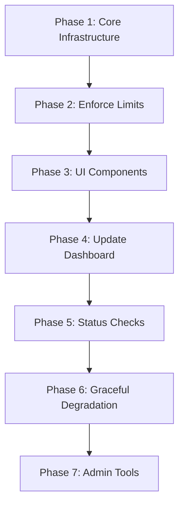

# Billing & Subscription Restriction Implementation Plan

## ✅ IMPLEMENTATION STATUS: COMPLETED

**Last Updated:** December 11, 2025

This document outlines the billing and subscription-based usage restriction implementation for the SAP CPI Connect application. The core implementation has been completed.

---

## Summary of Implemented Features

### Phase 1: Core Infrastructure ✅
- Created [`hooks/use-subscription.ts`](hooks/use-subscription.ts) with React hooks for accessing subscription data
- Added `checkAndIncrementUsage()` atomic function to [`app/actions/billing.ts`](app/actions/billing.ts)
- Added `getUsageLimitErrorMessage()` helper function

### Phase 2: Enforce Limits ✅
- **AI Agent Calls**: Added limit checks to:
  - [`app/actions/ai-agents.ts`](app/actions/ai-agents.ts) - `executeAgent()` function
  - [`app/actions/ai-agents-v2.ts`](app/actions/ai-agents-v2.ts) - `diagnoseError()`, `sendChatMessage()`, `analyzeIFlowPerformance()`
  - [`app/api/ai/diagnose-error/route.ts`](app/api/ai/diagnose-error/route.ts) - API route
- **Tenant Creation**: Added limit checks to:
  - [`app/actions/tenant.ts`](app/actions/tenant.ts) - `createTenant()` function
  - [`app/actions/tenant-actions.ts`](app/actions/tenant-actions.ts) - `createTenant()` function
- **Team Member Invitations**: Added limit checks to:
  - [`app/actions/tenant-invitations.ts`](app/actions/tenant-invitations.ts) - `inviteMember()` function
- **iFlow Sync**: Added limit checks to:
  - [`app/actions/tenant.ts`](app/actions/tenant.ts) - `syncTenantIFlows()` function (with smart limiting for new iFlows)

### Phase 3: UI Components ✅
- Created [`components/billing/usage-limit-alert.tsx`](components/billing/usage-limit-alert.tsx) - Alert for approaching/reached limits
- Created [`components/billing/usage-card.tsx`](components/billing/usage-card.tsx) - Card showing all usage metrics
- Created [`components/billing/upgrade-prompt-dialog.tsx`](components/billing/upgrade-prompt-dialog.tsx) - Dialog prompting upgrade
- Created [`components/billing/index.ts`](components/billing/index.ts) - Export file

### Phase 4: Monthly Reset Cron Job ✅
- Added monthly cron job to [`convex/crons.ts`](convex/crons.ts) (runs 1st of each month at midnight UTC)
- Added `resetAllMonthlyAICalls` action to [`convex/cronJobs.ts`](convex/cronJobs.ts)
- Added `resetAllMonthlyAIAgentCalls` internal mutation to [`convex/billingMutations.ts`](convex/billingMutations.ts)

### Existing Features (Already Implemented)
- Billing page with usage display ([`components/settings/billing-content.tsx`](components/settings/billing-content.tsx))
- Stripe integration for payments
- Subscription management (create, update, cancel, resume)
- Invoice history

---

## Original Implementation Plan

## Executive Summary

This document outlines the detailed implementation plan for restricting app usage based on subscription tiers. The Stripe integration is already complete, including:
- ✅ Subscription schema in Convex
- ✅ Stripe webhook handling
- ✅ Checkout session creation
- ✅ Billing portal integration
- ✅ Plan limits defined in [`lib/stripe-config.ts`](lib/stripe-config.ts)
- ✅ Basic usage tracking fields in subscription model
- ✅ `checkLimits` query in [`convex/billing.ts`](convex/billing.ts:242-306)
- ✅ `incrementUsage` / `decrementUsage` mutations in [`convex/billingMutations.ts`](convex/billingMutations.ts:178-280)

**What Was Missing (Now Implemented):**
- ✅ Actual enforcement of limits when creating resources
- ✅ Real-time usage tracking updates
- ✅ UI components showing usage limits and upgrade prompts
- ✅ Graceful degradation when limits are reached
- ✅ Monthly AI call reset cron job
- ⏳ Usage recalculation on subscription changes (optional enhancement)

## Implementation Decisions

Based on requirements:
1. **Priority**: AI Agent calls (most impactful) → Tenants → Team Members → iFlows
2. **Downgrade Behavior**: Keep existing resources accessible, prevent new ones
3. **Trial Period**: Full access to selected plan's limits
4. **AI Call Reset**: Implement monthly cron job (not currently present)

---

## Current Plan Limits

From [`lib/stripe-config.ts`](lib/stripe-config.ts:18-93):

| Feature | FREE | STARTER | PROFESSIONAL | ENTERPRISE |
|---------|------|---------|--------------|------------|
| CPI Tenants | 1 | 3 | 10 | Unlimited |
| iFlows | 10 | 50 | Unlimited | Unlimited |
| Team Members | 3 | 10 | 25 | Unlimited |
| AI Agent Calls/month | 100 | 500 | 2,000 | Unlimited |

---

## Implementation Tasks

### Phase 1: Core Infrastructure

#### 1.1 Create Subscription Context Provider

**File:** `components/subscription-provider.tsx`

Create a React context that provides subscription data throughout the app:

```typescript
// Provides:
// - Current subscription plan
// - Usage limits and current counts
// - Helper functions: canAddTenant(), canAddTeamMember(), canUseAIAgent()
// - Upgrade modal trigger
```

#### 1.2 Create Reusable Hooks

**File:** `hooks/use-subscription.ts`

```typescript
export function useSubscription() {
  // Returns subscription context
}

export function useSubscriptionLimit(limitType: 'tenants' | 'iflows' | 'teamMembers' | 'aiAgentCalls') {
  // Returns { current, max, canAdd, percentUsed }
}
```

#### 1.3 Create Limit Check Server Action

**File:** `app/actions/billing.ts` (extend existing)

Add a server action that checks limits AND increments usage atomically:

```typescript
export async function checkAndIncrementUsage(
  usageType: 'tenants' | 'iflows' | 'teamMembers' | 'aiAgentCalls'
): Promise<ActionResponse<{ allowed: boolean; current: number; max: number }>>
```

---

### Phase 2: Enforce Limits in Resource Creation

#### 2.1 Tenant Creation

**Files to modify:**
- [`app/actions/tenant-actions.ts`](app/actions/tenant-actions.ts) - Add limit check before creation
- [`app/actions/tenant.ts`](app/actions/tenant.ts) - Add limit check
- [`components/settings/add-tenant-dialog.tsx`](components/settings/add-tenant-dialog.tsx) - Show limit warning
- [`components/onboarding/onboarding-flow-cpi.tsx`](components/onboarding/onboarding-flow-cpi.tsx) - Check during onboarding

**Implementation:**
```typescript
// In createTenant action:
const limitCheck = await checkSubscriptionLimit('tenants');
if (!limitCheck.data?.allowed) {
  return { 
    success: false, 
    error: `Tenant limit reached (${limitCheck.data?.current}/${limitCheck.data?.max}). Please upgrade your plan.` 
  };
}

// After successful creation:
await incrementUsage('tenants');
```

#### 2.2 Team Member Invitations

**Files to modify:**
- [`app/actions/tenant-invitations.ts`](app/actions/tenant-invitations.ts:44-167) - Add limit check in `inviteMember()`
- [`convex/tenantMutations.ts`](convex/tenantMutations.ts:203-230) - Add limit check in `addMember()`

**Implementation:**
```typescript
// In inviteMember action:
const limitCheck = await checkSubscriptionLimit('teamMembers');
if (!limitCheck.data?.allowed) {
  return { 
    success: false, 
    error: `Team member limit reached. Upgrade to add more members.` 
  };
}

// After successful invitation acceptance:
await incrementUsage('teamMembers');
```

#### 2.3 AI Agent Execution

**Files to modify:**
- [`app/actions/ai-agents.ts`](app/actions/ai-agents.ts:144-245) - Add limit check in `executeAgent()`
- [`app/actions/ai-agents-v2.ts`](app/actions/ai-agents-v2.ts) - Add limit check
- [`app/api/ai/diagnose-error/route.ts`](app/api/ai/diagnose-error/route.ts) - Add limit check

**Implementation:**
```typescript
// In executeAgent action:
const limitCheck = await checkSubscriptionLimit('aiAgentCalls');
if (!limitCheck.data?.allowed) {
  return { 
    success: false, 
    error: `Monthly AI agent call limit reached (${limitCheck.data?.current}/${limitCheck.data?.max}). Upgrade for more calls.` 
  };
}

// After successful execution:
await incrementUsage('aiAgentCalls');
```

#### 2.4 iFlow Sync Operations

**Files to modify:**
- [`convex/iflowMutations.ts`](convex/iflowMutations.ts) - Add limit check when syncing new iFlows
- [`app/api/cron/sync-tenant/route.ts`](app/api/cron/sync-tenant/route.ts) - Respect limits during sync

**Implementation:**
- When syncing iFlows from SAP CPI, check if adding new iFlows would exceed the limit
- If limit reached, log warning and skip new iFlows (don't fail the sync)
- Show notification to user about skipped iFlows

---

### Phase 3: UI Components

#### 3.1 Usage Progress Component

**File:** `components/billing/usage-progress.tsx`

```tsx
interface UsageProgressProps {
  label: string;
  current: number;
  max: number;
  showUpgrade?: boolean;
}

// Shows a progress bar with current/max usage
// Changes color when approaching limit (>80% yellow, >95% red)
// Optional upgrade button when limit reached
```

#### 3.2 Upgrade Prompt Modal

**File:** `components/billing/upgrade-prompt-modal.tsx`

```tsx
interface UpgradePromptModalProps {
  open: boolean;
  onClose: () => void;
  feature: 'tenants' | 'iflows' | 'teamMembers' | 'aiAgentCalls';
  currentPlan: PlanType;
}

// Shows when user tries to exceed their limit
// Displays comparison of current plan vs recommended upgrade
// Direct link to checkout
```

#### 3.3 Limit Reached Banner

**File:** `components/billing/limit-reached-banner.tsx`

```tsx
// Dismissible banner shown at top of relevant pages
// "You've reached your tenant limit. Upgrade to add more."
```

#### 3.4 Plan Badge Component

**File:** `components/billing/plan-badge.tsx`

```tsx
// Shows current plan with icon
// Click to view billing page
```

---

### Phase 4: Update Dashboard Pages

#### 4.1 Main Dashboard

**File:** [`app/dashboard/page.tsx`](app/dashboard/page.tsx)

Add usage summary card showing:
- Current plan
- Usage for each limit type
- Days until AI calls reset

#### 4.2 AI Agents Page

**File:** [`app/dashboard/ai-agents/page.tsx`](app/dashboard/ai-agents/page.tsx)

- Show AI calls remaining prominently
- Disable agent cards when limit reached
- Show upgrade prompt

#### 4.3 Team Page

**File:** [`app/dashboard/team/page.tsx`](app/dashboard/team/page.tsx)

- Show team member count vs limit
- Disable invite button when limit reached
- Show upgrade prompt

#### 4.4 Settings/Billing Page

**File:** [`app/dashboard/settings/billing/page.tsx`](app/dashboard/settings/billing/page.tsx)

Already shows usage - ensure it's accurate and real-time.

---

### Phase 5: Subscription Status Checks

#### 5.1 Middleware for Protected Routes

**File:** `middleware.ts` (extend existing)

Check subscription status on protected routes:
- If subscription is `PAST_DUE` or `UNPAID`, show warning banner
- If subscription is `CANCELED`, restrict to FREE tier limits

#### 5.2 Subscription Status Banner

**File:** `components/billing/subscription-status-banner.tsx`

Show warning banners for:
- Payment failed (PAST_DUE)
- Subscription ending soon (cancelAtPeriodEnd)
- Trial ending soon

---

### Phase 6: Graceful Degradation

#### 6.1 Handle Downgrade Scenarios

When user downgrades or subscription expires:
- Don't delete existing resources
- Prevent creation of new resources beyond limit
- Show clear messaging about what's restricted

#### 6.2 Usage Recalculation

**File:** `convex/billingMutations.ts` (extend)

Add function to recalculate actual usage counts:
```typescript
export const recalculateUsage = mutation({
  // Count actual tenants, team members, iFlows for a user
  // Update subscription usage fields
});
```

Run this:
- On subscription change
- Periodically via cron job
- When user views billing page

---

### Phase 7: Admin Tools

#### 7.1 Admin Billing Dashboard

**File:** `app/(admin)/admin/billing/page.tsx`

Show:
- Revenue metrics (already in [`convex/billing.ts`](convex/billing.ts:183-237))
- Users approaching limits
- Failed payments
- Subscription distribution

#### 7.2 Manual Usage Override

Allow admins to:
- Adjust usage counts
- Grant temporary limit increases
- View detailed usage history

---

## Implementation Order



**Recommended Implementation Sequence:**

1. **Day 1-2:** Phase 1 - Create hooks and context
2. **Day 3-4:** Phase 2 - Enforce limits in all creation flows
3. **Day 5-6:** Phase 3 - Build UI components
4. **Day 7:** Phase 4 - Update dashboard pages
5. **Day 8:** Phase 5 - Add status checks
6. **Day 9:** Phase 6 - Handle edge cases
7. **Day 10:** Phase 7 - Admin tools

---

## Files to Create

| File | Purpose |
|------|---------|
| `components/subscription-provider.tsx` | Context provider for subscription data |
| `hooks/use-subscription.ts` | Hooks for accessing subscription data |
| `components/billing/usage-progress.tsx` | Progress bar for usage display |
| `components/billing/upgrade-prompt-modal.tsx` | Modal prompting upgrade |
| `components/billing/limit-reached-banner.tsx` | Banner for limit warnings |
| `components/billing/plan-badge.tsx` | Badge showing current plan |
| `components/billing/subscription-status-banner.tsx` | Banner for payment issues |
| `app/(admin)/admin/billing/page.tsx` | Admin billing dashboard |

## Files to Modify

| File | Changes |
|------|---------|
| `app/actions/tenant-actions.ts` | Add limit check before tenant creation |
| `app/actions/tenant.ts` | Add limit check and usage increment |
| `app/actions/tenant-invitations.ts` | Add limit check before invitation |
| `app/actions/ai-agents.ts` | Add limit check before AI execution |
| `app/actions/ai-agents-v2.ts` | Add limit check before AI execution |
| `app/api/ai/diagnose-error/route.ts` | Add limit check |
| `convex/tenantMutations.ts` | Add limit check in addMember |
| `convex/iflowMutations.ts` | Add limit check during sync |
| `components/settings/add-tenant-dialog.tsx` | Show limit warning UI |
| `components/onboarding/onboarding-flow-cpi.tsx` | Check limits during onboarding |
| `app/dashboard/page.tsx` | Add usage summary |
| `app/dashboard/ai-agents/page.tsx` | Show AI calls remaining |
| `app/dashboard/team/page.tsx` | Show team member limits |
| `app/layout.tsx` | Add SubscriptionProvider |

---

## Testing Checklist

- [ ] Free user cannot create more than 1 tenant
- [ ] Free user cannot invite more than 3 team members
- [ ] Free user cannot make more than 100 AI calls/month
- [ ] Upgrade flow works from limit-reached modal
- [ ] Usage counts update in real-time
- [ ] Downgrade properly restricts new resource creation
- [ ] Existing resources remain accessible after downgrade
- [ ] Payment failure shows appropriate warning
- [ ] Admin can view billing metrics
- [ ] Monthly AI call reset works correctly (1st of each month)
- [ ] Trial users have full access to plan limits
- [ ] Subscription status banners show for payment issues

---

## Cron Job for Monthly AI Call Reset

Add to [`convex/crons.ts`](convex/crons.ts):

```typescript
// Reset AI agent calls on the 1st of each month at midnight UTC
crons.monthly(
    "reset-ai-agent-calls",
    { day: 1, hourUTC: 0, minuteUTC: 0 },
    internal.cronJobs.resetMonthlyAIAgentCalls
);
```

Add to [`convex/cronJobs.ts`](convex/cronJobs.ts):

```typescript
import { internal } from "./_generated/api";

export const resetMonthlyAIAgentCalls = internalAction({
    args: {},
    handler: async (ctx) => {
        console.log('🔄 Resetting monthly AI agent calls...');
        await ctx.runMutation(internal.billingMutations.resetMonthlyAIAgentCalls);
        console.log('✅ Monthly AI agent calls reset complete');
    },
});
```

Note: The `resetMonthlyAIAgentCalls` mutation already exists in [`convex/billingMutations.ts`](convex/billingMutations.ts:285-296).

---

## Security Considerations

1. **Server-side enforcement:** All limit checks MUST happen on the server, not just UI
2. **Atomic operations:** Check and increment should be atomic to prevent race conditions
3. **Audit logging:** Log all limit check failures for monitoring
4. **Rate limiting:** Prevent abuse of limit check endpoints

---

## Rollback Plan

If issues arise:
1. Feature flag to disable limit enforcement
2. Keep existing resources accessible
3. Revert to previous billing page version
4. Manual intervention for affected users