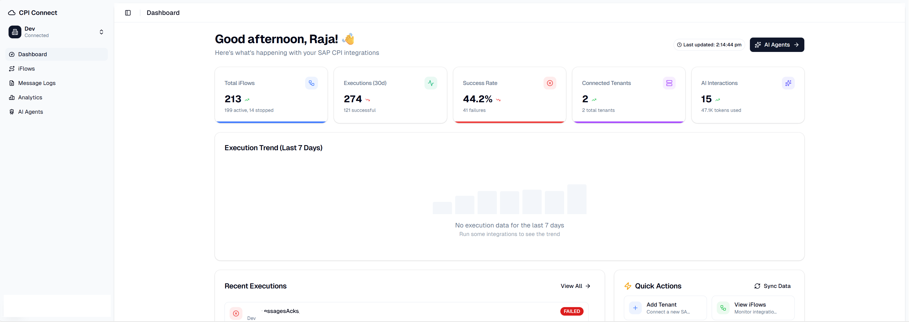

<a href="https://www.cpiconnect.io">
  <h1 align="center">CPI Connect: SAP CPI Monitoring & Analytics Platform</h1>
</a>

<p align="center">
  A modern, AI-powered cloud platform for monitoring and managing SAP Cloud Platform Integration (CPI) tenants, iFlows, and executions with intelligent automation capabilities.
</p>

<p align="center">
  
</p>

<p align="center">
  <a href="#introduction"><strong>Introduction</strong></a> ·
  <a href="#installation"><strong>Installation</strong></a> ·
  <a href="#tech-stack--features"><strong>Tech Stack + Features</strong></a> ·
  <a href="#mcp-server"><strong>MCP Server</strong></a> ·
  <a href="#architecture"><strong>Architecture</strong></a> ·
  <a href="#directory-structure"><strong>Directory Structure</strong></a> ·
  <a href="#contributing"><strong>Contributing</strong></a>
</p>
<br/>

## Introduction

CPI Connect is a comprehensive cloud-based monitoring and analytics platform designed to streamline SAP Cloud Platform Integration operations. Built on **Next.js 16** with **React 19** and powered by **Convex** for real-time data, it provides multi-tenant management, AI-powered automation agents with MCP (Model Context Protocol) integration, and detailed execution monitoring.

**Highlights**
- **Multi-tenant SAP CPI Management** – Connect and manage multiple SAP CPI tenants with OAuth, Basic Auth, or Service Key authentication.
- **iFlow Monitoring & Execution Tracking** – Real-time visibility into integration flows, execution history, and performance metrics.
- **AI-Powered Automation Agents** – 10 specialized agents for iFlow creation, error diagnosis, performance optimization, security auditing, and more.
- **MCP Server Integration** – Model Context Protocol server enabling AI assistants to interact with SAP CPI in real-time.
- **Modern Authentication** – Clerk-based authentication with social providers, magic links, and secure session management.
- **Real-time Dashboard** – Live updates via Convex, execution trend charts, and quick action panels.
- **Team Collaboration** – Workspace invitations, role-based access control (Owner/Admin/Member/Viewer), and tenant sharing.
- **Subscription Billing** – Stripe-powered billing with Free, Starter, Professional, and Enterprise plans.

## Installation

Clone the repository and install dependencies:

```bash
git clone https://github.com/raja83v/my-sapcpipconnect-app.git
cd my-sapcpipconnect-app
pnpm install
```

Set up environment variables:

```bash
cp .env.example .env.local
```

Update `.env.local` with your credentials:

| Variable | Description |
|----------|-------------|
| `CONVEX_DEPLOYMENT` | Your Convex deployment URL |
| `NEXT_PUBLIC_CONVEX_URL` | Public Convex URL for client-side access |
| `NEXT_PUBLIC_CLERK_PUBLISHABLE_KEY` | Clerk publishable key |
| `CLERK_SECRET_KEY` | Clerk secret key |
| `NEXT_PUBLIC_APP_URL` | Your application URL (e.g., `https://www.cpiconnect.io`) |
| `RESEND_API_KEY` | (Optional) Resend API key for transactional emails |
| `STRIPE_SECRET_KEY` | (Optional) Stripe secret key for billing |
| `STRIPE_WEBHOOK_SECRET` | (Optional) Stripe webhook signing secret |
| `ANTHROPIC_API_KEY` | (Optional) Anthropic API key for AI agents |
| `GOOGLE_GENERATIVE_AI_API_KEY` | (Optional) Google AI API key for AI agents |

Initialize Convex:

```bash
npx convex dev
```

Start the development server:

```bash
pnpm dev
```

### Available Commands

| Command | Description |
|---------|-------------|
| `pnpm dev` | Start development server with Turbopack |
| `pnpm build` | Build for production with Turbopack |
| `pnpm start` | Start production server |
| `pnpm lint` | Run ESLint |
| `pnpm email` | Launch React Email preview server |
| `pnpm convex:dev` | Start Convex development server |
| `pnpm convex:deploy` | Deploy Convex functions to production |

## Tech Stack + Features

### Frameworks & Platforms
- **Next.js 16** – App Router, Server Actions, and Turbopack for fast development.
- **React 19** – Latest React with concurrent features and improved performance.
- **Convex 1.30** – Real-time backend with type-safe queries, mutations, and automatic subscriptions.
- **Clerk** – Modern authentication with social providers, magic links, and user management.
- **Vercel** – Optimized deployment with edge functions and serverless capabilities.

### UI & UX
- **Shadcn UI & Tailwind CSS 4** – Component library with design tokens and Radix primitives.
- **Geist Font** – Modern typography with sans and mono variants.
- **Recharts** – Interactive charts for execution trends and analytics.
- **Lucide & Tabler Icons** – Consistent iconography across the application.
- **Motion (Framer Motion)** – Smooth animations and transitions.
- **Sonner** – Toast notifications with a modern design.
- **Responsive Design** – Mobile-first approach with adaptive layouts.

### SAP CPI Integration
- **Multi-Tenant Support** – Connect multiple SAP CPI environments (Dev, QA, Prod).
- **Authentication Methods** – OAuth 2.0, Basic Auth, and Service Key support.
- **iFlow Management** – View, sync, and monitor integration flows.
- **Execution Tracking** – Real-time execution status, duration, and error categorization.
- **BPMN2 Parser** – Parse and generate SAP CPI iFlow BPMN2 definitions.
- **Sync Capabilities** – Manual and automated (cron-based) synchronization of iFlow data.

### AI Agent Capabilities
Powered by **Vercel AI SDK** with support for **Anthropic Claude** and **Google Gemini** models:

| Agent | Description |
|-------|-------------|
| **General Assistant** | General-purpose SAP CPI assistance |
| **iFlow Creator** | AI-assisted creation of integration flows with BPMN2 generation |
| **Smart Monitor** | Intelligent monitoring and alerting |
| **Performance Optimizer** | Automated optimization recommendations |
| **Error Diagnostician** | AI-powered error analysis and resolution suggestions |
| **Security Auditor** | Security compliance checks and vulnerability detection |
| **Documentation Generator** | Automated documentation for iFlows |
| **Test Case Generator** | AI-generated test scenarios |
| **Cost Analyzer** | Usage analysis and cost optimization insights |
| **Predictive Insights** | Trend analysis and predictive recommendations |

### Application Features
- **Dashboard** – Overview with stats, execution trends, active iFlows, and quick actions.
- **Tenant Management** – Add, configure, and monitor SAP CPI tenants.
- **Message Logs** – Detailed execution logs with filtering and search.
- **Team Collaboration** – Invite team members with role-based permissions.
- **Settings** – Profile, workspace, and billing configuration.
- **Admin Panel** – User management, impersonation, analytics, and system settings.
- **Help Center** – Integrated documentation and support articles.
- **Blog & Changelog** – Content management with MDX support.

## MCP Server

CPI Connect includes a **Model Context Protocol (MCP) server** that enables AI assistants to interact with SAP CPI in real-time. The MCP server provides:

### Tool Categories
- **Monitoring** – Message logs, error info, run steps
- **iFlow** – CRUD operations, configuration, performance metrics
- **Package** – List, details, create integration packages
- **Action** – Deploy, restart, create, undeploy (with confirmation)
- **Analytics** – Stats, trends, metrics

### Features
- **Zod Schema Validation** – All tool inputs are strictly validated
- **Caching** – 30-60s TTL for read operations
- **Rate Limiting** – 30 req/min for reads, 5 req/min for actions
- **Audit Logging** – All executions are logged
- **Confirmation Dialogs** – Destructive actions require user confirmation

### Integration Points
- `mcp-server/src/` – MCP server implementation
- `app/api/mcp/tools/` – REST API endpoint for tool execution
- `lib/ai/tools.ts` – Vercel AI SDK integration
- `components/ai/` – Tool execution visualization and confirmation dialogs

See [MCP_SERVER_README.md](MCP_SERVER_README.md) for detailed documentation.

## Architecture

CPI Connect follows a modern, scalable architecture:

```
┌─────────────────────────────────────────────────────────────────┐
│                        Frontend (Next.js 16)                     │
│  - App Router with route groups                                  │
│  - Server Components & Server Actions                            │
│  - Clerk authentication                                          │
└─────────────────────────────────────────────────────────────────┘
                               │
                               ▼
┌─────────────────────────────────────────────────────────────────┐
│                     Convex Backend                               │
│  - Real-time subscriptions                                       │
│  - Type-safe queries & mutations                                 │
│  - Cron jobs for sync                                            │
└─────────────────────────────────────────────────────────────────┘
                               │
                               ▼
┌─────────────────────────────────────────────────────────────────┐
│                    SAP CPI Client                                │
│  - OAuth 2.0 / Basic Auth / Service Key                          │
│  - OData API integration                                         │
│  - BPMN2 parsing & generation                                    │
└─────────────────────────────────────────────────────────────────┘
```

### Route Groups
- **`app/(marketing)`** – Public landing pages and marketing content
- **`app/(auth)`** – Sign-in, sign-up, and SSO callback
- **`app/(admin)`** – Admin panel for user/workspace management
- **`app/(onboarding)`** – User onboarding flow
- **`app/dashboard`** – Authenticated dashboard

### Key Patterns
- **Server Actions** – Business logic in `app/actions/*` with typed inputs and `ActionResult` outputs.
- **Convex Backend** – Real-time data layer with schemas for users, tenants, iFlows, executions, and AI agent tracking.
- **Component Architecture** – Shared UI primitives in `components/ui`, feature-specific components organized by domain.
- **Configuration** – Centralized settings in `lib/config.ts` for SEO, branding, and feature flags.

## Directory Structure

```
.
├── app
│   ├── (marketing)        # Public landing pages, blog, help center
│   ├── (auth)             # Sign-in, sign-up, SSO callback
│   ├── (admin)            # Admin panel (users, workspaces, analytics)
│   ├── (onboarding)       # User onboarding flow
│   ├── dashboard          # Main application dashboard
│   │   ├── ai-agents      # AI agent interfaces and analytics
│   │   ├── iflows         # iFlow listing and details
│   │   ├── message-logs   # Execution message logs
│   │   ├── analytics      # Analytics and reporting
│   │   ├── lifecycle      # iFlow lifecycle management
│   │   ├── settings       # User and workspace settings
│   │   └── team           # Team management
│   ├── actions            # Server actions for all business logic
│   │   └── admin          # Admin-specific actions
│   └── api                # API routes
│       ├── auth           # Auth-related endpoints
│       ├── billing        # Stripe checkout and portal
│       ├── cron           # Cron job endpoints
│       ├── mcp            # MCP server tools endpoint
│       ├── sap-cpi        # SAP CPI proxy endpoints
│       └── webhooks       # Clerk and Stripe webhooks
├── components
│   ├── ui                 # Shadcn UI component library (50+ components)
│   ├── ai                 # AI agent UI components
│   ├── dashboard          # Dashboard-specific components
│   ├── settings           # Settings forms and tables
│   ├── marketing          # Marketing page components
│   └── onboarding         # Onboarding flow components
├── content                # MDX content (blog, help, legal, team)
├── convex                 # Convex backend
│   ├── schema.ts          # Database schema
│   ├── *.ts               # Queries and mutations
│   └── lib                # Shared utilities (encryption)
├── emails                 # React Email templates
├── hooks                  # Custom React hooks
├── lib
│   ├── ai                 # AI agent types, prompts, tools
│   ├── blog               # Blog utilities
│   ├── notifications      # Email service
│   ├── sap-cpi            # SAP CPI client and BPMN2 parser
│   └── validations        # Zod schemas
├── mcp-server             # MCP server implementation
│   └── src
│       ├── handlers       # Tool handlers by category
│       ├── tools          # Tool registry
│       └── utils          # Cache, rate limiter, confirmation
├── public                 # Static assets
├── scripts                # Build and utility scripts
└── types                  # TypeScript type definitions
```

## Key Features

### Dashboard Overview
- **Stats Cards** – Total tenants, active iFlows, execution counts, and AI usage metrics.
- **Execution Trend Chart** – 7-day visualization of successful vs failed executions.
- **Active iFlows** – Top 10 deployed integrations with status and last run time.
- **Quick Actions** – One-click access to add tenants, view iFlows, AI agents, and analytics.
- **AI Agent Usage** – Track AI interactions and token consumption.

### Tenant Management
- **Connection Testing** – Verify SAP CPI connectivity before saving.
- **Credential Encryption** – Secure storage of authentication credentials.
- **Status Monitoring** – Real-time connection status and last sync timestamps.
- **iFlow Synchronization** – Pull latest iFlow data from SAP CPI.
- **Cron-based Sync** – Automated background synchronization.

### AI Agents
- **Natural Language Interface** – Interact with AI agents using conversational prompts.
- **Context-Aware** – Agents understand your tenant and iFlow context.
- **Tool Execution** – Real-time tool calls with visual feedback.
- **Usage Tracking** – Monitor token usage and interaction history.
- **Multiple Specializations** – Choose the right agent for your task.

### Billing & Subscriptions
- **Stripe Integration** – Secure payment processing.
- **Multiple Plans** – Free, Starter, Professional, Enterprise.
- **Usage Limits** – Tenants, iFlows, team members, AI calls per plan.
- **Customer Portal** – Self-service subscription management.

## Data Models

The application uses Convex with the following core models:

| Model | Description |
|-------|-------------|
| `users` | User accounts with Clerk integration and Stripe billing |
| `sessions` | User sessions with tenant context |
| `cpiTenants` | SAP CPI tenant configurations |
| `iFlows` | Integration flows synced from SAP CPI |
| `iFlowExecutions` | Execution history and message logs |
| `tenantMembers` | User-tenant membership with roles |
| `tenantInvitations` | Pending team invitations |
| `aiAgentExecutions` | AI agent interaction history |
| `subscriptions` | User subscription plans and usage |
| `invoices` | Billing invoice records |

## Contributing

We welcome contributions! To get involved:

1. **Fork the repository** and create a feature branch.
2. **Open an issue** for bugs, feature requests, or questions.
3. **Submit a pull request** with clear scope and description.
4. **Share feedback** on the platform's capabilities and user experience.

### Development Guidelines
- Follow the existing code style and patterns.
- Add tests for new features when applicable.
- Update documentation for significant changes.
- Use conventional commit messages.

## License

This project is licensed under the **AGPL-3.0 License** - see the [LICENSE.md](LICENSE.md) file for details.

---

<p align="center">
  Built with ❤️ by the CPI Connect team
</p>
