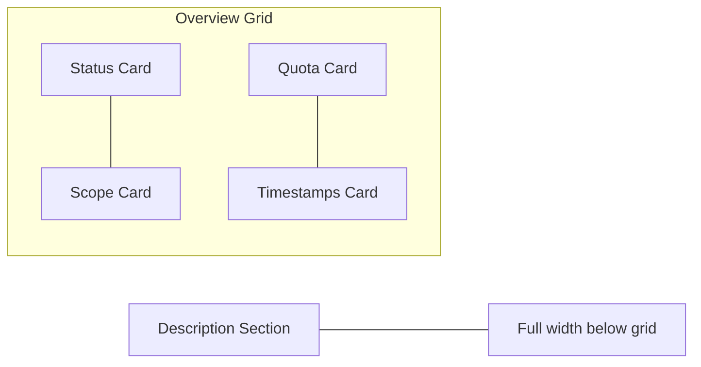
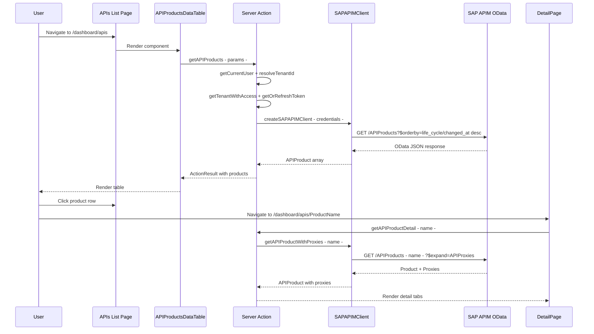

# API Products Dashboard — Implementation Plan

## Overview

Add an **APIs** section to the dashboard that displays all API Products deployed in SAP API Management (APIM) on Integration Suite (Cloud Foundry). This mirrors the existing iFlows pattern with a list page, detail page, server actions, and APIM client updates.

---

## Architecture

```mermaid
graph TD
    A[Sidebar: APIs nav item] --> B[/dashboard/apis - List Page]
    B --> C[APIProductsDataTable component]
    C --> D[getAPIProducts server action]
    D --> E[SAPAPIMClient.getAPIProducts]
    E --> F[OData: /apiportal/api/1.0/Management.svc/APIProducts]
    
    B --> G[/dashboard/apis/name - Detail Page]
    G --> H[APIProductDetailTabs component]
    H --> I[getAPIProductDetail server action]
    I --> J[SAPAPIMClient.getAPIProductWithProxies]
    J --> K[OData: APIProducts - name with $expand=APIProxies]
    
    C -.->|useTenantRefresh| L[TenantContext]
    D -.->|auth| M[getTenantWithAccess + getOrRefreshToken]
```

---

## Files to Create/Modify

### 1. Sidebar Navigation

**Modify:** [`components/app-sidebar.tsx`](components/app-sidebar.tsx)

- Add `IconApi` import from `@tabler/icons-react`
- Insert new nav item between iFlows and Message Logs:

```typescript
{
  title: "APIs",
  url: "/dashboard/apis",
  icon: IconApi,
},
```

**Final nav order:** Dashboard → iFlows → **APIs** → Message Logs → Analytics → AI Agents

---

### 2. Breadcrumb Support

**Modify:** [`components/dynamic-breadcrumb.tsx`](components/dynamic-breadcrumb.tsx)

- Add `apis: "APIs"` to `SEGMENT_NAME_MAP`
- Add handling for API Product detail pages similar to iFlow detail pages — resolve `name` param to display title in breadcrumb

---

### 3. APIM Client Updates

**Modify:** [`lib/sap-cpi/apim-client.ts`](lib/sap-cpi/apim-client.ts)

#### 3a. Update `APIProduct` interface

The current interface is missing the `life_cycle` nested object from the OData response. Update to:

```typescript
export interface APIProduct {
  name: string;
  title: string;
  description?: string;
  status: string;           // PUBLISHED, DEPRECATED, etc.
  scope?: string;
  quota?: number;
  quotaInterval?: number;
  quotaTimeUnit?: string;   // MINUTE, HOUR, DAY, MONTH
  createdAt?: string;
  modifiedAt?: string;
  // Navigation properties
  apiProxies?: APIProxy[];
}
```

#### 3b. Update `getAPIProducts()` method

Current issues:
- Orders by `name asc` — should use `life_cycle/changed_at desc` per confirmed endpoint
- Missing search/status filter support
- `quota`/`quotaInterval` typed as `string` but should be `number`

Updated signature:

```typescript
async getAPIProducts(params: {
  search?: string;
  status?: string;
  top?: number;
  skip?: number;
  orderBy?: string;
} = {}): Promise<{ results: APIProduct[]; count?: number }>
```

Key changes:
- Default `$orderby` to `life_cycle/changed_at desc`
- Add `$filter` support for `status` and `substringof` search on `name`/`title`
- Map `life_cycle/changed_at` → `modifiedAt` and `life_cycle/created_at` → `createdAt`

#### 3c. Add `getAPIProductDetail()` method

```typescript
async getAPIProductDetail(productName: string): Promise<APIProduct | null>
```

Endpoint: `/APIProducts('${productName}')?$format=json`

#### 3d. Add `getAPIProductWithProxies()` method

```typescript
async getAPIProductWithProxies(productName: string): Promise<APIProduct | null>
```

Endpoint: `/APIProducts('${productName}')?$format=json&$expand=APIProxies`

This fetches the product and its associated API Proxies in a single OData call using the `APIProxies` navigation property.

#### 3e. Add `getAPIProductProxies()` method

```typescript
async getAPIProductProxies(productName: string): Promise<APIProxy[]>
```

Endpoint: `/APIProducts('${productName}')/APIProxies?$format=json`

Fallback method if `$expand` is not supported — fetches proxies via navigation property link.

---

### 4. Server Actions

**Create:** [`app/actions/api-products.ts`](app/actions/api-products.ts)

Follow the exact pattern from [`app/actions/apim-message-logs.ts`](app/actions/apim-message-logs.ts:199) for auth/tenant resolution.

#### Types

```typescript
export interface APIProductListItem {
  name: string;
  title: string;
  description?: string;
  status: string;
  scope?: string;
  quota?: number;
  quotaInterval?: number;
  quotaTimeUnit?: string;
  modifiedAt?: string;
  createdAt?: string;
  tenantId: string;
  tenantName: string;
}

export interface GetAPIProductsParams {
  tenantId?: string;
  page?: number;
  pageSize?: number;
  search?: string;
  status?: string;  // "all" | "PUBLISHED" | "DEPRECATED" etc.
}

export interface GetAPIProductsResult {
  products: APIProductListItem[];
  total: number;
  page: number;
  pageSize: number;
  totalPages: number;
  fetchedAt: string;
}

export interface APIProductDetailResult {
  product: APIProductListItem;
  proxies: APIProxyInfo[];
}

export interface APIProxyInfo {
  name: string;
  title: string;
  description?: string;
  basePath: string;
  state: string;        // DEPLOYED, UNDEPLOYED
  serviceEndPoint?: string;
  version?: string;
  modifiedAt?: string;
}
```

#### Server Action Functions

```typescript
// 1. List API Products with pagination and filtering
export async function getAPIProducts(
  params: GetAPIProductsParams
): Promise<ActionResult<GetAPIProductsResult>>

// 2. Get single API Product with its proxies
export async function getAPIProductDetail(
  productName: string,
  tenantId?: string
): Promise<ActionResult<APIProductDetailResult>>

// 3. Get proxies for a product (standalone)
export async function getAPIProductProxies(
  productName: string,
  tenantId?: string
): Promise<ActionResult<{ proxies: APIProxyInfo[] }>>
```

**Auth pattern** — reuse from [`app/actions/apim-message-logs.ts`](app/actions/apim-message-logs.ts:199):
1. `getCurrentUser()` → authenticate
2. `resolveTenantId()` → determine tenant
3. `getTenantWithAccess()` → validate membership + get credentials
4. `getOrRefreshToken()` → get/cache OAuth token
5. `createSAPAPIMClient()` → create client with injected token

> **Refactoring opportunity:** Extract the shared auth helpers (`resolveTenantId`, `getTenantWithAccess`, `getOrRefreshToken`, `getAPIMToken`) into a shared module like `lib/sap-cpi/apim-auth.ts` to avoid duplication. However, for this initial implementation, we can duplicate the pattern to keep the scope focused.

---

### 5. APIs List Page

**Create:** [`app/dashboard/apis/page.tsx`](app/dashboard/apis/page.tsx)

Follows the pattern from [`app/dashboard/iflows/page.tsx`](app/dashboard/iflows/page.tsx):

```tsx
export default function APIsPage() {
  return (
    <div className="container mx-auto py-8 px-4 sm:px-6 lg:px-8">
      <div className="flex flex-col gap-6">
        <div>
          <h1 className="text-3xl font-bold tracking-tight">APIs</h1>
          <p className="text-muted-foreground mt-1">
            Browse and manage API Products from SAP API Management
          </p>
        </div>
        <APIProductsDataTable />
      </div>
    </div>
  );
}
```

**Create:** [`app/dashboard/apis/loading.tsx`](app/dashboard/apis/loading.tsx)

Skeleton loading state matching [`app/dashboard/iflows/loading.tsx`](app/dashboard/iflows/loading.tsx) pattern — header skeleton, toolbar skeleton, table rows skeleton.

---

### 6. API Products Data Table Component

**Create:** [`components/dashboard/api-products-data-table.tsx`](components/dashboard/api-products-data-table.tsx)

Follows the pattern from [`components/dashboard/iflows-data-table.tsx`](components/dashboard/iflows-data-table.tsx) exactly:

#### State Management
- `products: APIProductListItem[]`
- `isLoading`, `isInitialLoad`
- `total`, `page`, `pageSize`, `totalPages`
- `selectedStatus` filter — options: All, PUBLISHED, DEPRECATED
- `searchQuery` — search by name/title
- `sortBy`, `sortOrder`

#### Key Features
- **Tenant awareness:** Uses [`useTenantRefresh()`](components/tenant-context.tsx:60) to reload when tenant changes
- **Search:** Input with `IconSearch` icon, searches name/title
- **Status filter:** Select dropdown — All Status, Published, Deprecated
- **Refresh button:** Manual reload with spinning icon
- **Results count:** "Showing X of Y API Products"

#### Table Columns
| Column | Width | Content |
|--------|-------|---------|
| Title | 30% | Product title, links to `/dashboard/apis/{name}` |
| Name | 20% | Technical name in `<code>` tag |
| Status | 10% | Badge — PUBLISHED=green, DEPRECATED=orange, default=outline |
| Quota | 15% | Formatted as "X calls / interval timeUnit" or "—" |
| Last Modified | 15% | Relative time + absolute date |
| Actions | 10% | View details button |

#### Status Badge Mapping
```typescript
function getStatusBadge(status: string) {
  switch (status) {
    case "PUBLISHED":
      return <Badge className="bg-green-500">Published</Badge>;
    case "DEPRECATED":
      return <Badge className="bg-orange-500">Deprecated</Badge>;
    case "RETIRED":
      return <Badge variant="destructive">Retired</Badge>;
    default:
      return <Badge variant="outline">{status}</Badge>;
  }
}
```

#### Empty State
- `IconApi` icon
- "No API Products found"
- Contextual message based on active filters

#### Pagination
- Previous/Next buttons matching iFlows pattern
- Page X of Y indicator

---

### 7. API Product Detail Page

**Create:** [`app/dashboard/apis/[name]/page.tsx`](app/dashboard/apis/[name]/page.tsx)

Follows the pattern from [`app/dashboard/iflows/[id]/page.tsx`](app/dashboard/iflows/[id]/page.tsx):

```tsx
export default async function APIProductDetailPage({ params }: PageProps) {
  const { name } = await params;
  return (
    <div className="container mx-auto py-8 px-4 sm:px-6 lg:px-8">
      <Suspense fallback={<APIProductDetailSkeleton />}>
        <APIProductDetailContent name={name} />
      </Suspense>
    </div>
  );
}
```

- `APIProductDetailSkeleton` — skeleton for header + tabs
- `APIProductDetailContent` — async server component that calls `getAPIProductDetail(name)`
- `ErrorCard` — error state with back link to `/dashboard/apis`

---

### 8. API Product Detail Components

**Create:** [`components/dashboard/api-product-detail/`](components/dashboard/api-product-detail/) directory

#### 8a. `api-product-detail-tabs.tsx`

Main tabbed interface with two tabs:

**Tab 1: Overview**
- Product metadata cards in a grid:
  - Name, Title, Description
  - Status badge
  - Scope
  - Quota settings — quota count, interval, time unit
  - Created/Modified timestamps

**Tab 2: API Proxies**
- Table of associated proxies with columns:
  - Name — links to proxy detail or external SAP link
  - Base Path
  - State badge — DEPLOYED=green, UNDEPLOYED=secondary
  - Service Endpoint
  - Version
- Empty state if no proxies

#### 8b. `api-product-overview-tab.tsx`

Overview tab content — grid of info cards:



#### 8c. `api-product-proxies-tab.tsx`

Proxies tab — table listing all API Proxies in this product.

#### 8d. `index.ts`

Barrel export file.

---

## Data Flow



---

## OData Query Patterns

### List API Products
```
GET {tenantUrl}/apiportal/api/1.0/Management.svc/APIProducts
  ?$skip=0
  &$top=52
  &$orderby=life_cycle/changed_at desc
  &$format=json
  &$inlinecount=allpages
```

### List with Status Filter
```
GET .../APIProducts
  ?$filter=status eq 'PUBLISHED'
  &$orderby=life_cycle/changed_at desc
  &$format=json
```

### List with Search
```
GET .../APIProducts
  ?$filter=(substringof('searchterm', name) or substringof('searchterm', title))
  &$orderby=life_cycle/changed_at desc
  &$format=json
```

### Single Product Detail
```
GET .../APIProducts('ProductName')
  ?$format=json
```

### Product with Proxies Expanded
```
GET .../APIProducts('ProductName')
  ?$format=json
  &$expand=APIProxies
```

### Product Proxies Only
```
GET .../APIProducts('ProductName')/APIProxies
  ?$format=json
```

---

## Implementation Order

The tasks should be implemented in this order to ensure dependencies are satisfied:

1. **APIM Client updates** — Update types and add new methods in [`lib/sap-cpi/apim-client.ts`](lib/sap-cpi/apim-client.ts)
2. **Server actions** — Create [`app/actions/api-products.ts`](app/actions/api-products.ts) with all three action functions
3. **Data table component** — Create [`components/dashboard/api-products-data-table.tsx`](components/dashboard/api-products-data-table.tsx)
4. **List page + loading** — Create [`app/dashboard/apis/page.tsx`](app/dashboard/apis/page.tsx) and [`app/dashboard/apis/loading.tsx`](app/dashboard/apis/loading.tsx)
5. **Detail components** — Create [`components/dashboard/api-product-detail/`](components/dashboard/api-product-detail/) directory with tabs, overview, and proxies tabs
6. **Detail page** — Create [`app/dashboard/apis/[name]/page.tsx`](app/dashboard/apis/[name]/page.tsx)
7. **Sidebar update** — Add APIs nav item to [`components/app-sidebar.tsx`](components/app-sidebar.tsx)
8. **Breadcrumb update** — Add APIs support to [`components/dynamic-breadcrumb.tsx`](components/dynamic-breadcrumb.tsx)

---

## File Summary

| Action | File Path | Description |
|--------|-----------|-------------|
| **Modify** | `lib/sap-cpi/apim-client.ts` | Update APIProduct type, fix getAPIProducts, add 3 new methods |
| **Create** | `app/actions/api-products.ts` | Server actions for API Products |
| **Create** | `components/dashboard/api-products-data-table.tsx` | Client-side data table with filters |
| **Create** | `app/dashboard/apis/page.tsx` | List page |
| **Create** | `app/dashboard/apis/loading.tsx` | Loading skeleton |
| **Create** | `app/dashboard/apis/[name]/page.tsx` | Detail page |
| **Create** | `components/dashboard/api-product-detail/api-product-detail-tabs.tsx` | Tabbed detail view |
| **Create** | `components/dashboard/api-product-detail/api-product-overview-tab.tsx` | Overview tab |
| **Create** | `components/dashboard/api-product-detail/api-product-proxies-tab.tsx` | Proxies tab |
| **Create** | `components/dashboard/api-product-detail/index.ts` | Barrel exports |
| **Modify** | `components/app-sidebar.tsx` | Add APIs nav item |
| **Modify** | `components/dynamic-breadcrumb.tsx` | Add APIs breadcrumb support |

**Total: 10 new files, 3 modified files**
