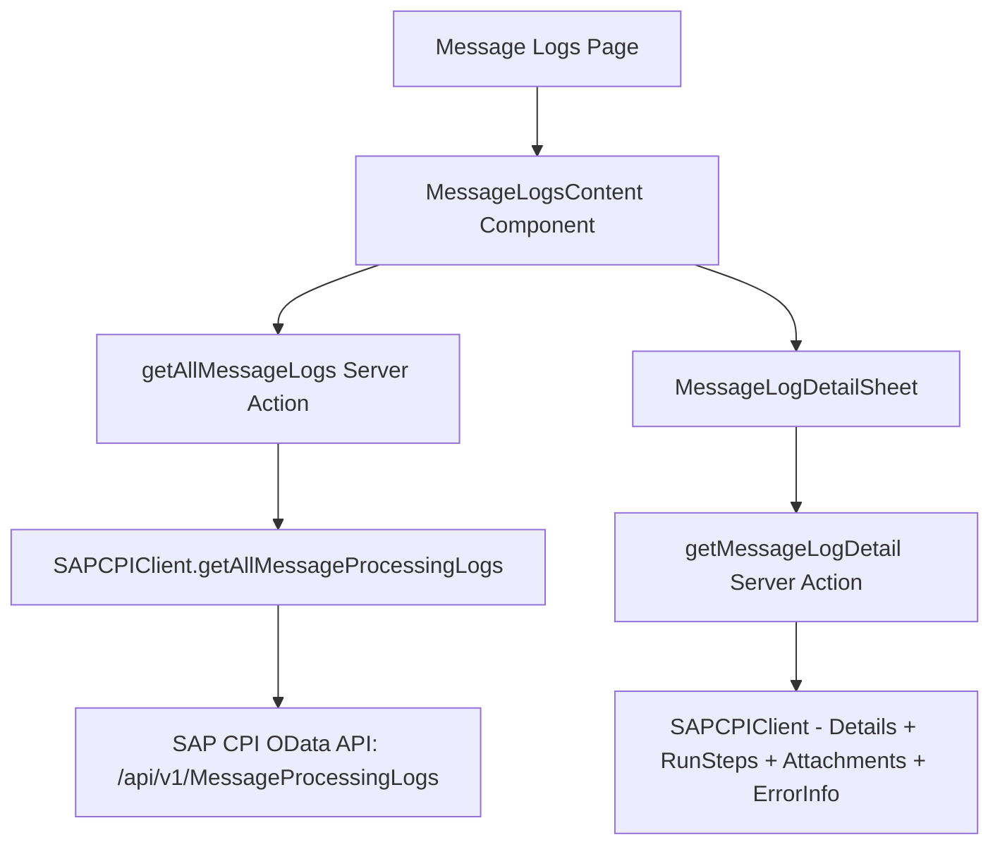
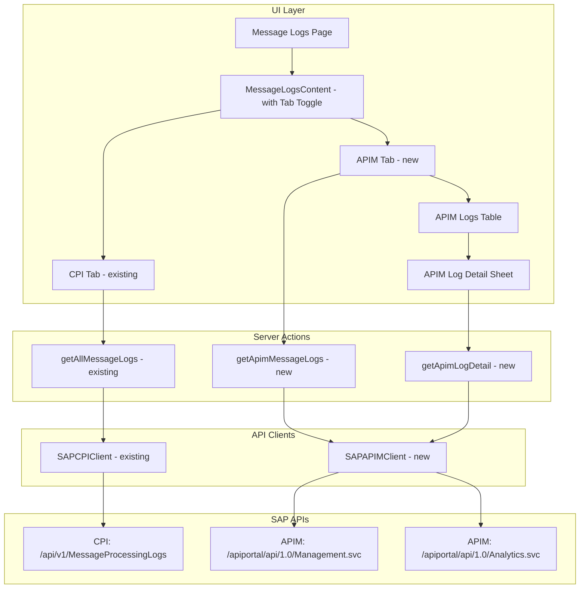
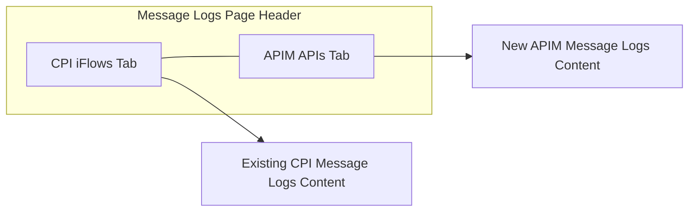
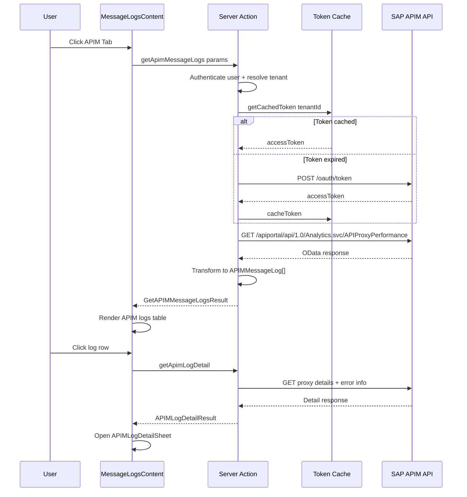

# APIM Message Logs Implementation Plan

## Overview

Extend the existing Message Logs feature to include API Management (APIM) API proxy execution logs alongside the current CPI iFlow message logs. The APIM instance shares the same BTP subaccount credentials as the CPI tenant, and the APIM URL is derivable from the existing CPI tenant URL (same host, different API path).

---

## Current Architecture Summary

### Existing Message Logs Flow



### Key Files Involved

| File | Purpose |
|------|---------|
| [`app/actions/message-logs.ts`](app/actions/message-logs.ts) | Server actions for fetching/filtering message logs |
| [`lib/sap-cpi/client.ts`](lib/sap-cpi/client.ts) | SAP CPI API client with OAuth, message log methods |
| [`components/dashboard/message-logs-content.tsx`](components/dashboard/message-logs-content.tsx) | Main message logs page UI with filters, table, pagination |
| [`components/dashboard/message-log-detail-sheet.tsx`](components/dashboard/message-log-detail-sheet.tsx) | Detail sheet for individual message inspection |
| [`lib/db/schema.ts`](lib/db/schema.ts) | Database schema - `cpiTenants`, `iFlows`, `iFlowExecutions` |
| [`mcp-server/src/handlers/monitoring.ts`](mcp-server/src/handlers/monitoring.ts) | MCP server monitoring tool handlers |
| [`mcp-server/src/tools/registry.ts`](mcp-server/src/tools/registry.ts) | MCP tool definitions and schemas |

---

## SAP APIM API Reference

SAP API Management exposes monitoring data through the API Portal Management OData API. The key endpoints for API proxy execution logs:

### Base URL Pattern
```
{tenantUrl}/apiportal/api/1.0/Management.svc
```

### Key OData Entities

| Entity | Description |
|--------|-------------|
| `APIProxies` | List of all API proxies |
| `APIProducts` | API products grouping proxies |
| `APIProxyEndPoints` | Proxy endpoint configurations |
| `Applications` | Developer applications |

### Monitoring/Analytics Endpoints
```
{tenantUrl}/apiportal/api/1.0/Management.svc/APIProxies
{tenantUrl}/apiportal/api/1.0/Management.svc/APIProducts
```

### API Analytics Data (via Analytics API)
```
GET {tenantUrl}/apiportal/api/1.0/Analytics.svc/
    APIProxyPerformance?$filter=...
```

Key analytics entities:
- `APIProxyPerformance` - Per-proxy call metrics
- `APIProxyErrorDetails` - Error details per proxy
- `APIProxyTrafficData` - Traffic volume data

### Authentication
Same OAuth client credentials as CPI tenant - the token obtained from `authenticationUrl` works for both CPI and APIM APIs on the same BTP subaccount.

---

## Implementation Plan

### Architecture Overview



---

### Phase 1: APIM API Client

**New file: `lib/sap-cpi/apim-client.ts`**

Create a dedicated APIM client that reuses the same OAuth authentication as the CPI client.

#### Types to Define

```typescript
// API Proxy representation
interface APIProxy {
  name: string;
  title: string;
  description: string;
  basePath: string;
  virtualHost: string;
  state: string; // DEPLOYED, UNDEPLOYED
  version: string;
  createdAt: string;
  modifiedAt: string;
  createdBy: string;
  modifiedBy: string;
  serviceEndPoint: string;
}

// APIM execution/call log entry
interface APIMCallLog {
  apiProxyName: string;
  apiProxyPath: string;
  statusCode: number;
  responseTime: number;       // ms
  requestSize: number;        // bytes
  responseSize: number;       // bytes
  clientIP: string;
  timestamp: string;
  method: string;             // GET, POST, PUT, DELETE
  targetHost: string;
  errorMessage: string | null;
  isError: boolean;
  developerApp: string | null;
  apiProduct: string | null;
  proxyRevision: string;
  region: string;
}

// APIM performance summary
interface APIMProxyPerformance {
  apiProxyName: string;
  totalCalls: number;
  successCount: number;
  errorCount: number;
  avgResponseTime: number;
  maxResponseTime: number;
  minResponseTime: number;
  totalTraffic: number;       // bytes
  errorRate: number;          // percentage
  timeRange: string;
}
```

#### Client Methods

```typescript
class SAPAPIMClient {
  // Reuses SAPCPIClient auth mechanism
  constructor(credentials: SAPCPICredentials)

  // List all API proxies
  getAPIProxies(): Promise<APIProxy[]>

  // Get API proxy details
  getAPIProxyDetails(proxyName: string): Promise<APIProxy>

  // Get API proxy call logs / analytics
  getAPIProxyCallLogs(params: {
    proxyName?: string;
    fromDate?: Date;
    toDate?: Date;
    statusCode?: number;
    top?: number;
    skip?: number;
  }): Promise<{ results: APIMCallLog[]; count?: number }>

  // Get performance metrics for a proxy
  getAPIProxyPerformance(params: {
    proxyName?: string;
    fromDate?: Date;
    toDate?: Date;
  }): Promise<APIMProxyPerformance[]>

  // Get error details for a proxy
  getAPIProxyErrors(params: {
    proxyName?: string;
    fromDate?: Date;
    toDate?: Date;
    top?: number;
  }): Promise<APIMCallLog[]>
}
```

#### Key Implementation Details

- Derive APIM base URL from tenant URL: `${tenantUrl}/apiportal/api/1.0/`
- Reuse the same OAuth token obtained via `getAccessToken()` from the parent `SAPCPIClient`
- Share the token cache mechanism from [`lib/token-cache.ts`](lib/token-cache.ts)
- Handle OData response format differences between CPI and APIM APIs

---

### Phase 2: Server Actions for APIM Logs

**New file: `app/actions/apim-message-logs.ts`**

#### Types

```typescript
interface APIMMessageLog {
  id: string;
  apiProxyName: string;
  apiProxyPath: string;
  method: string;
  statusCode: number;
  responseTime: number;
  timestamp: string;
  clientIP: string;
  isError: boolean;
  errorMessage: string | null;
  requestSize: number;
  responseSize: number;
  developerApp: string | null;
  apiProduct: string | null;
  // Tenant info
  tenantId: string;
  tenantName: string;
}

interface GetAPIMMessageLogsParams {
  tenantId?: string;
  page?: number;
  pageSize?: number;
  proxyName?: string;       // Filter by specific API proxy
  statusCode?: string;      // Filter: 2xx, 4xx, 5xx, or specific code
  fromDate?: string;
  toDate?: string;
  searchQuery?: string;
}

interface GetAPIMMessageLogsResult {
  logs: APIMMessageLog[];
  total: number;
  page: number;
  pageSize: number;
  totalPages: number;
  fetchedAt: string;
}
```

#### Server Actions

| Action | Description |
|--------|-------------|
| `getApimMessageLogs()` | Fetch paginated APIM call logs with filtering |
| `getApimLogDetail()` | Get detailed info for a specific API call |
| `getApiProxiesForFilter()` | Get list of API proxies for filter dropdown |
| `diagnoseApimError()` | AI-powered diagnosis of APIM errors |

These follow the same pattern as the existing [`getAllMessageLogs()`](app/actions/message-logs.ts:210) action:
1. Authenticate user
2. Resolve tenant
3. Check membership/access
4. Get/refresh OAuth token
5. Create APIM client
6. Fetch and transform data

---

### Phase 3: UI - Tab Toggle on Message Logs Page

**Modified file: `components/dashboard/message-logs-content.tsx`**

Add a tab toggle at the top of the Message Logs page to switch between CPI and APIM views.



#### UI Changes

1. **Tab Component**: Add `Tabs` / `TabsList` / `TabsTrigger` at the top of [`MessageLogsContent`](components/dashboard/message-logs-content.tsx:140)
2. **CPI Tab**: Wraps the existing message logs content unchanged
3. **APIM Tab**: New component with APIM-specific filters and table

#### APIM Tab Filters

| Filter | Type | Description |
|--------|------|-------------|
| API Proxy | Combobox/Select | Filter by specific API proxy name |
| Status Code | Select | All / 2xx Success / 4xx Client Error / 5xx Server Error |
| HTTP Method | Select | All / GET / POST / PUT / DELETE / PATCH |
| Date Range | Date picker | Same presets as CPI: 1h, 6h, 24h, 7d, 30d, custom |
| Search | Text input | Search by client IP, proxy path, or error message |

#### APIM Table Columns

| Column | Description |
|--------|-------------|
| Timestamp | When the API call was made |
| API Proxy | Name of the API proxy |
| Method | HTTP method - GET, POST, etc. |
| Path | The API endpoint path called |
| Status | HTTP status code with color badge |
| Response Time | Duration in ms |
| Size | Request/Response size |
| Client | Client IP or app name |

---

### Phase 4: APIM Log Detail Sheet

**New file: `components/dashboard/apim-log-detail-sheet.tsx`**

Similar to [`MessageLogDetailSheet`](components/dashboard/message-log-detail-sheet.tsx) but tailored for APIM data.

#### Detail Sheet Tabs

| Tab | Content |
|-----|---------|
| Overview | API proxy name, method, path, status code, timestamps, response time, sizes |
| Request/Response | Headers, query params, request body preview if available |
| Error Details | Error message, fault details, target endpoint errors |
| AI Diagnosis | AI-powered error analysis - reuse streaming pattern from existing sheet |

---

### Phase 5: APIM Logs Table Component

**New file: `components/dashboard/apim-message-logs-content.tsx`**

Standalone component for the APIM tab content, following the same patterns as the existing [`MessageLogsContent`](components/dashboard/message-logs-content.tsx):

- Filter bar with API proxy selector, status code filter, method filter, date range
- Auto-refresh capability
- Paginated table with sortable columns
- Click-to-open detail sheet
- Export functionality

---

### Phase 6: MCP Server Extension

**Modified files in `mcp-server/`**

#### New Tool Definitions

Add to [`mcp-server/src/types.ts`](mcp-server/src/types.ts):

```typescript
// APIM Monitoring schemas
const GetAPIMLogsInputSchema = z.object({
  proxyName: z.string().optional(),
  statusCode: z.string().optional(),
  fromDate: z.string().optional(),
  toDate: z.string().optional(),
  limit: z.number().min(1).max(100).default(50),
});

const GetAPIMProxyListInputSchema = z.object({
  search: z.string().optional(),
  state: z.enum(['DEPLOYED', 'UNDEPLOYED']).optional(),
});

const GetAPIMErrorsInputSchema = z.object({
  proxyName: z.string().optional(),
  fromDate: z.string().optional(),
  toDate: z.string().optional(),
  limit: z.number().min(1).max(50).default(10),
});
```

#### New Handler File

**New file: `mcp-server/src/handlers/apim-monitoring.ts`**

| Handler | Tool Name | Description |
|---------|-----------|-------------|
| `handleGetAPIMLogs` | `get_apim_logs` | Fetch APIM API call logs |
| `handleGetAPIMProxies` | `list_api_proxies` | List all API proxies |
| `handleGetAPIMErrors` | `get_apim_errors` | Get APIM error details |

#### Registry Updates

Add new tools to [`mcp-server/src/tools/registry.ts`](mcp-server/src/tools/registry.ts):

- `get_apim_logs` - category: monitoring
- `list_api_proxies` - category: iflow (or new category: apim)
- `get_apim_errors` - category: monitoring

---

### Phase 7: Tenant Capabilities Extension

**Modified file: `lib/sap-cpi/tenant-capabilities.ts`**

Add APIM capability detection:

```typescript
// Add to TenantCapabilities interface
apimEnabled: boolean;
apimProxyCount: number;

// New function
async function tryDetectAPIM(client: SAPCPIClient): Promise<boolean> {
  // Try to hit the APIM management endpoint
  // If it responds, APIM is available on this tenant
}
```

This allows the UI to conditionally show/hide the APIM tab based on whether the tenant has APIM configured.

---

## File Change Summary

### New Files

| File | Description |
|------|-------------|
| `lib/sap-cpi/apim-client.ts` | SAP APIM API client |
| `app/actions/apim-message-logs.ts` | Server actions for APIM logs |
| `components/dashboard/apim-message-logs-content.tsx` | APIM logs tab content component |
| `components/dashboard/apim-log-detail-sheet.tsx` | APIM log detail side sheet |
| `mcp-server/src/handlers/apim-monitoring.ts` | MCP server APIM monitoring handlers |

### Modified Files

| File | Changes |
|------|---------|
| `components/dashboard/message-logs-content.tsx` | Add tab toggle between CPI and APIM |
| `lib/sap-cpi/tenant-capabilities.ts` | Add APIM detection |
| `mcp-server/src/types.ts` | Add APIM tool schemas and response types |
| `mcp-server/src/tools/registry.ts` | Register APIM monitoring tools |
| `mcp-server/src/executor.ts` | Wire up APIM handlers |

### No Changes Required

| File | Reason |
|------|--------|
| `lib/db/schema.ts` | No new DB tables needed - APIM logs are fetched live from SAP APIs |
| `components/app-sidebar.tsx` | No new nav items - APIM is a tab within existing Message Logs |
| `app/dashboard/message-logs/page.tsx` | Page wrapper stays the same |

---

## Data Flow Diagram



---

## Implementation Order

The implementation should proceed in this order to allow incremental testing:

1. **APIM Client** (`lib/sap-cpi/apim-client.ts`) - Foundation layer
2. **Server Actions** (`app/actions/apim-message-logs.ts`) - Data fetching layer
3. **APIM Logs Table Component** (`components/dashboard/apim-message-logs-content.tsx`) - Display layer
4. **APIM Detail Sheet** (`components/dashboard/apim-log-detail-sheet.tsx`) - Detail view
5. **Tab Toggle Integration** (modify `message-logs-content.tsx`) - Combine CPI + APIM
6. **Tenant Capabilities** (modify `tenant-capabilities.ts`) - Conditional APIM tab
7. **MCP Server Extension** (new handlers + registry updates) - AI tool access

---

## Risk Considerations

| Risk | Mitigation |
|------|------------|
| APIM API may not be available on all tenants | Add capability detection; gracefully hide APIM tab if unavailable |
| APIM OData response format may differ from CPI | Build dedicated parser/transformer in APIM client |
| OAuth token scope may not cover APIM APIs | Document required OAuth scopes; show clear error if access denied |
| APIM analytics data volume could be large | Implement server-side pagination with `$top` and `$skip` |
| Rate limiting on APIM APIs | Reuse existing rate limiter pattern from MCP server |
